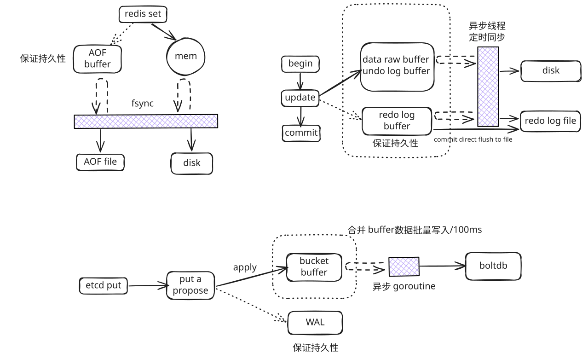

> 今日得到：**如果你要做好架构，首先你得把计算机体系结构以及很多老古董的基础技术吃透了** 。在软件开发或设计中，在之前先去参考一下已有的设计和思路，**看看相应的 guideline，best practice 或 design pattern，吃透了已有的这些东西，再决定是否要重新发明轮子**

> 转载自：[《左耳朵耗子-缓存更新的套路》](https://coolshell.cn/articles/17416.html)

# 背景

在写更新缓存数据代码时， **先删除缓存，然后再更新数据库** ，而后续的操作会把数据再装载的缓存中。 **然而，这个是逻辑是错误的** 。试想，两个并发操作，一个是更新操作，另一个是查询操作，更新操作删除缓存后，查询操作没有命中缓存，先把老数据读出来后放到缓存中，然后更新操作更新了数据库。于是，在缓存中的数据还是老的数据，导致缓存中的数据是脏的，而且还一直这样脏下去了。

更新缓存的的 Design Pattern 有四种：Cache aside, Read through, Write through, Write behind caching

# Cache aside

这是最常用最常用的 pattern 了。其具体逻辑如下：

- **失效** ：应用程序先从 cache 取数据，没有得到，则从数据库中取数据，成功后，放到缓存中。
- **命中** ：应用程序从 cache 中取数据，取到后返回。
- **更新** ：先把数据存到数据库中，成功后，再让缓存失效。

注意，我们的更新是先更新数据库，成功后，让缓存失效。那么，这种方式是否可以没有文章前面提到过的那个问题呢？我们可以脑补一下。

一个是查询操作，一个是更新操作的并发，首先，没有了删除 cache 数据的操作了，而是先更新了数据库中的数据，此时，缓存依然有效，所以，并发的查询操作拿的是没有更新的数据，但是，更新操作马上让缓存的失效了，后续的查询操作再把数据从数据库中拉出来。而不会像文章开头的那个逻辑产生的问题，后续的查询操作一直都在取老的数据。

这是标准的 design pattern，包括 Facebook 的论文《[Scaling Memcache at Facebook](https://www.usenix.org/system/files/conference/nsdi13/nsdi13-final170_update.pdf)》也使用了这个策略。为什么不是写完数据库后更新缓存？你可以看一下 Quora 上的这个问答《[Why does Facebook use delete to remove the key-value pair in Memcached instead of updating the Memcached during write request to the backend?](https://www.quora.com/Why-does-Facebook-use-delete-to-remove-the-key-value-pair-in-Memcached-instead-of-updating-the-Memcached-during-write-request-to-the-backend)》，主要是怕两个并发的写操作导致脏数据。

那么，是不是 Cache Aside 这个就不会有并发问题了？不是的，比如，一个是读操作，但是没有命中缓存，然后就到数据库中取数据，此时来了一个写操作，写完数据库后，让缓存失效，然后，之前的那个读操作再把老的数据放进去，所以，会造成脏数据。

但，这个 case 理论上会出现，不过，实际上出现的概率可能非常低，因为这个条件需要发生在读缓存时缓存失效，而且并发着有一个写操作。而实际上数据库的写操作会比读操作慢得多，而且还要锁表，而读操作必需在写操作前进入数据库操作，而又要晚于写操作更新缓存，所有的这些条件都具备的概率基本并不大。

# Read/Write Through Pattern

我们可以看到，在上面的 Cache Aside 套路中，我们的应用代码需要维护两个数据存储，一个是缓存（Cache），一个是数据库（Repository）。所以，应用程序比较啰嗦。而 Read/Write Through 套路是把更新数据库（Repository）的操作由缓存自己代理了，所以，对于应用层来说，就简单很多了。**可以理解为，应用认为后端就是一个单一的存储，而存储自己维护自己的 Cache。**

##### Read Through

Read Through 套路就是在查询操作中更新缓存，也就是说，当缓存失效的时候（过期或 LRU 换出），Cache Aside 是由调用方负责把数据加载入缓存，而 Read Through 则用缓存服务自己来加载，从而对应用方是透明的。

##### Write Through

Write Through 套路和 Read Through 相仿，不过是在更新数据时发生。当有数据更新的时候，如果没有命中缓存，直接更新数据库，然后返回。如果命中了缓存，则更新缓存，然后再由 Cache 自己更新数据库（这是一个同步操作）

# Write behind

Write Back 套路，一句说就是，在更新数据的时候，只更新缓存，不更新数据库，而我们的缓存会异步地批量更新数据库。这个设计的好处就是让数据的 I/O 操作飞快无比（因为直接操作内存嘛 ），因为异步，write backg 还可以合并对同一个数据的多次操作，所以性能的提高是相当可观的。

但是，其带来的问题是，数据不是强一致性的，而且可能会丢失（我们知道 Unix/Linux 非正常关机会导致数据丢失，就是因为这个事）。在软件设计上，我们基本上不可能做出一个没有缺陷的设计，就像算法设计中的时间换空间，空间换时间一个道理，有时候，强一致性和高性能，高可用和高性性是有冲突的。软件设计从来都是取舍 Trade-Off。

操作系统 Page Cache, 以及很多数据库的实现都是有这个设计思路

redis, etcd, mysql 都是先写缓存然后在通过异步线程定时同步写入到 disk，

当然还有额外的机制如 redis AOF, etcd WAL, mysql redo log 都是用来保证数据的持久化，强一致性，做的掉电保护，这些额外的磁盘文件写入机制，由于是顺序 IO，性能都比写磁盘高。

# 总结

# 参考与延伸阅读
