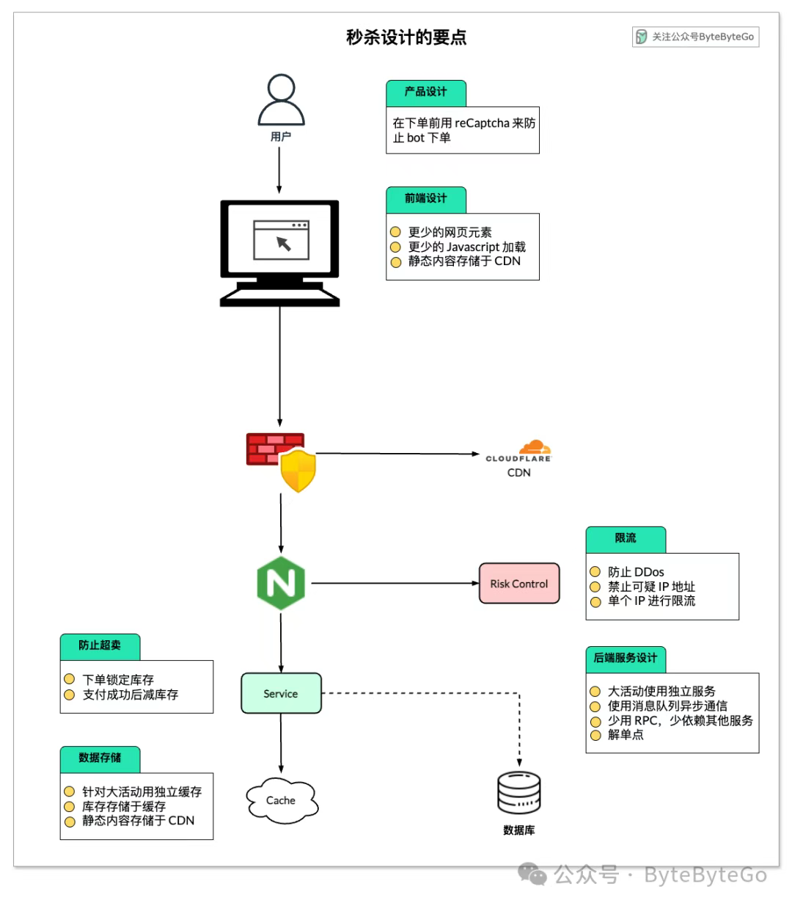

> 以下内容为个人记录，本文非结构化内容，纯属个人知识点记录
>
> TODO: 整理后结构化吸收

# 背景

在设计之前应该清楚秒杀的场景，已经会出现什么问题，然后才能逐个解决

## 核心业务特点

1. 瞬时高并发
2. 有限库存，防止超卖
3. 用户体验优先：即使抢购失败，也需要提供即时反馈，避免长时间等待

## 技术挑战

1. 流量洪峰：瞬时高峰可能压垮系统资源
2. 超卖问题：在高并发场景下，多线程，多副本并发更新库存，导致数据超卖
3. **系统高可用** ：需要保证在极端流量下系统仍能提供稳定服务，不出现大面积服务不可用
4. **性能瓶颈** ：传统数据库难以承受每秒数万甚至数十万的请求，需要优化数据访问路径
5. **防作弊机制** ：防止机器人、秒杀器等非人工手段抢购，保证活动公平性

# 流量洪峰

## 前端

1. 页面动静分离：相关因素能少则少，比如优惠券，预计送达等动态计算的功能多可以不需要，详情页面可以静态化，加快访问速度
2. CDN 加速：让用户就近获取所需内容，降低网络拥塞，提高用户访问响应速度和命中率。
3. 秒杀按钮：秒杀开始前置灰，开始后做防抖限制，1s 内只能点击几次

## 后端

### 流量削峰

1. 缓冲排队： 将请求放入 mq 中慢慢消费，类似大坝蓄洪，只留几个出口慢慢流出
2. 答题拖延：答题可以避免机器人，秒杀器，也能拖延请求进入的时间
3. 分层过滤：漏斗模型，流量一层层过滤
4. 限流：对同一用户，同一 ip，接口限流

好比上班高峰期，地铁都是很挤的，那地铁是怎么处理这么大人流的。

1. 排队
2. 分流，有些从这个口，有这从那个口
3. 阻塞等待，确实堵住了，那就只能阻塞等待

## 业务侧设计

1. 商家侧，秒杀活动报名制，服务器提前做好准备
2. 买家侧，秒杀预约制，只有预约的人才能参与秒杀，就可以过滤掉一大批人
3. 在预约后就可以预约的人做风险管控，对账号进行分析，判断是否是黄牛等

# 如何解决超卖问题

## 1. 数据库扣减库存

```sql
update product set stock=stock-1 where id=123 and stock > 0;
```

但需要频繁访问数据库，我们都知道数据库连接是非常昂贵的资源。在高并发的场景下，可能会造成系统雪崩。而且，容易出现多个请求，同时竞争行锁的情况，造成相互等待，从而出现死锁的问题。

## 2. Redis+lua 预扣库存

1. 秒杀开始前，先将商品信息加载到 redis 中，提前预热
2. 利用 redis 事务 lua 原子性来防止超卖，代码如下
3. 当然要用 redis 集群

## 消息队列(MQ)异步消费扣减库存

订单请求先进入 **Kafka / RabbitMQ** 队列，后台消费者 **顺序扣减库存** 。

## 方案对比总结

[电商系统如何防止超卖？](https://www.zhihu.com/question/402246926)

[防止库存超卖的几种方案](https://www.forestyoung.top/2025/03/08/%E9%98%B2%E6%AD%A2%E5%BA%93%E5%AD%98%E8%B6%85%E5%8D%96%E7%9A%84%E5%87%A0%E7%A7%8D%E6%96%B9%E6%A1%88/#5-%E6%B6%88%E6%81%AF%E9%98%9F%E5%88%97%EF%BC%88MQ%EF%BC%89%E5%BC%82%E6%AD%A5%E6%89%A3%E5%87%8F%E5%BA%93%E5%AD%98)

[如何根据并发量选择合适的库存方案？](https://www.forestyoung.top/2025/03/08/%E5%A6%82%E4%BD%95%E6%A0%B9%E6%8D%AE%E5%B9%B6%E5%8F%91%E9%87%8F%E9%80%89%E6%8B%A9%E5%90%88%E9%80%82%E7%9A%84%E5%BA%93%E5%AD%98%E6%96%B9%E6%A1%88%EF%BC%9F/)

| 方案               | 适用场景 | 并发性能 | 可靠性 | 实现难度 |
| ------------------ | -------- | -------- | ------ | -------- |
| **乐观锁**         | 低并发   | 中       | 高     | 低       |
| **悲观锁**         | 中等并发 | 低       | 高     | 中       |
| **分布式锁**       | 分布式   | 中       | 高     | 中       |
| **Redis 预扣库存** | 高并发   | 高       | 中     | 高       |
| **消息队列**       | 极高并发 | 最高     | 高     | 高       |

## **2. 根据并发量选择合适的方案**

| 并发量       | QPS         | TPS      | 并发用户 | 适用方案                                | 说明                                     |
| ------------ | ----------- | -------- | -------- | --------------------------------------- | ---------------------------------------- |
| **低并发**   | <100        | <50      | <10      | ✅`SELECT ... FOR UPDATE`               | 适合小型业务，数据一致性要求高，锁竞争低 |
| **中等并发** | 100~1000    | 50~300   | 10~100   | ✅ 乐观锁（`version`）✅ Redis 分布式锁 | 适合普通电商场景，减少数据库锁竞争       |
| **高并发**   | 1000~10,000 | 300~5000 | 100~1000 | ✅ Redis 预扣库存 ✅ 订单队列异步处理   | 适合大促销、抢购，避免数据库瓶颈         |
| **超高并发** | >10,000     | >5000    | >1000    | ✅ 限流+异步扣减 ✅ CDN 缓存            | 适合秒杀，数据库无法承受高并发写入       |

## **各种库存控制方案的优缺点**

| 方案                                  | 适用场景                   | 优势                         | 缺点                             |
| ------------------------------------- | -------------------------- | ---------------------------- | -------------------------------- |
| **悲观锁（`SELECT ... FOR UPDATE`）** | 低并发，数据强一致性场景   | 数据强一致性                 | 低效，容易死锁                   |
| **乐观锁（`version` 字段）**          | 中等并发，减少锁冲突       | 高并发下比悲观锁好           | 并发极高时失败率上升             |
| **Redis 分布式锁**                    | 分布式系统，库存竞争不激烈 | 支持跨节点，减少数据库压力   | 需要额外 Redis 依赖              |
| **Redis 预扣库存**                    | 秒杀、高并发场景           | 高性能，不依赖数据库锁       | 需要定期回滚库存，数据一致性较低 |
| **消息队列异步扣减**                  | 超高并发（如 12306 抢票）  | 降低数据库压力，支持峰值削峰 | 复杂度高，数据最终一致性         |

# 有损模式-主流方案

1. 业务干预
   1. 提报：商家报名秒杀活动，提早知道商品、价格、活动开始时间、面向什么地域、预计参与人数、会员要求等等信息。可以预估出大致流量，支撑编排活动调整活动组合分散压力（也能不断保持热点），调整计算机资源应对高并发。设置参与门槛，阻挡非目标人群参与。
   2. 预约制，多活动做预约，预估大致参与活动的人数帮助评估计算资源容量。引入风控规则，提早过滤刷子人群。
   3. 限购：借助限购系统，排除非目标人群，比如从地区限制，仅华东可以参与购买；从用户限制，自家员工禁止购买（主要是担心舆情公关危机，不能既做裁判也下场踢球）。提高离散度，比如从商品限制，一次只能购买一件，一人一个月只能购买一次。
2. 有损削峰
   1. 限流降级：对同用户/同 IP/接口进行限流
   2. 分层限流：网关->独立秒杀集群服务->单接口
3. 防刷风控
   1. 基于 userId 限流
   2. 基于黑名单限流
   3. 答题
   4. 验证码
4. 库存扣减
   1. 走 db 的原子性，当然部分头部电商还是采用弱缓存抗读（非库存不足，不实时更新），DB 抗写的方案。这个的前提在于，通过一系列技术方案，流量落到库存已经相对低且平滑了（扛得住，不用再自己实现操作原子性）。
   2. 走 redis 的预热扣减，实现较复杂，要考虑与 db 的同步

# [设计原则](https://mp.weixin.qq.com/s/WwhpJgh3BaWeejoPLYNv-A)



秒杀主要解决两个问题

1. 并发读
2. 并发写

并发读的核心优化理念是尽量减少用户到服务端来“读”数据，或者让他们读更少的数据；并发写的处理原则也一样，减少对主库的访问，那就是要独立出秒杀库，当然还要做一些额外的保护措施。

**秒杀系统本质上就是一个满足大并发、高性能和高可用的分布式系统** 。从一个架构师的角度来看，要想打造并维护一个超大流量并发读写、高性能、高可用的系统，在整个用户请求路径上从浏览器到服务端我们要遵循几个原则，就是要保证用户请求

- 数据尽量少
- 请求数尽量少
- 路径尽量短
- 依赖尽量少
- 不要有单点

# 参考与延伸阅读

1. [敖丙带你设计【秒杀系统】](https://mp.weixin.qq.com/s/KWb3POodisbOEsQVblsoGw)
2. [许令波老师-极客时间-如何设计一个秒杀系统](https://time.geekbang.org/column/intro/100017501)
3. [秒杀系统设计-少了个分号](https://mp.weixin.qq.com/s/u7yp_SpJS18kkzoXdUNXCw)
