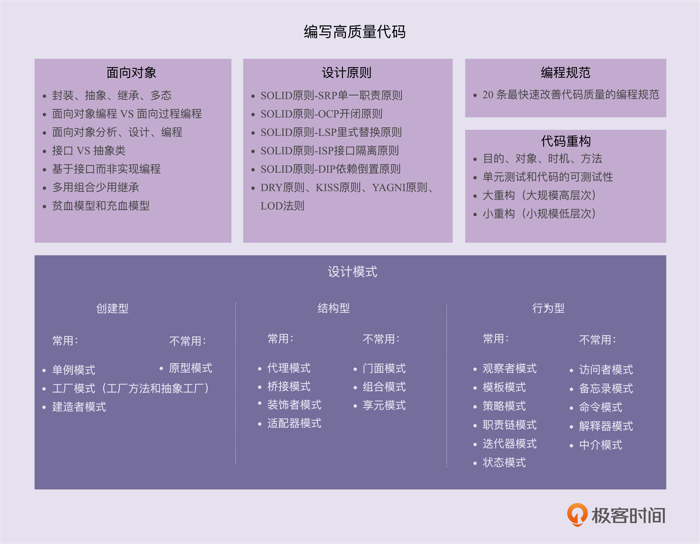

[03 | 面向对象、设计原则、设计模式、编程规范、重构，这五者有何关系？-设计模式之美-极客时间](https://time.geekbang.org/column/article/160991)



**面向对象设计的本质就是把合适的代码放到合适的类中**

# 1. **设计原则-SOLID**

## 1.1. **单一职责-SRP**

**Single Responsibility Principle （A class or module should have a single responsibility）**

**⚠️**记住：**如果两个功能因不同原因在不同时间变化，它们就该分开，保持类的内聚性，不要让类太小而失去意义。SRP 的目标不是创建大量微小的类，而是创建职责明确、易于维护的类结构。**

### 1.1.1. **如何理解单一职责原则？**

**一个类/一个函数只负责完成一个功能。不要设计大而全的类，要设计粒度小，功能单一的类。**

**单一职责原则是为了实现代码的高内聚，低耦合，提高代码的复用性，可读性，可维护性。**

### 1.1.2. **如何判断类的职责是否足够单一？**

**不同的应用场景、不同阶段的需求背景、不同的业务层面，对同一个类的职责是否单一，可能会有不同的判定结果。实际上，一些侧面的判断指标更具有指导意义和可执行性，比如，出现下面这些情况就有可能说明这类的设计不满足单一职责原则：**

- **类中的代码行数、函数或者属性过多；**
- **类依赖的其他类过多，或者依赖类的其他类过多；**
- **私有方法过多；**
- **比较难给类起一个合适的名字；**
- **类中大量的方法都是集中操作类中的某几个属性。**
- **当修改某个代码时，如果牵一发而动全身，那就耦合度太高了**

### 1.1.3. **类的职责是否设计越单一越好**

**单一职责原则通过避免设计大而全的类，避免将不相关的功能耦合在一起，来提高类的内聚性。同时，类职责单一，类依赖的和被依赖的其他类也会变少，减少了代码的耦合性，以此来实现代码的高内聚、低耦合。但是，如果拆分得过细，实际上会适得其反，反倒会降低内聚性，也会影响代码的可维护性**

**什么事情都是适得其反。**

### 1.1.4. **实例分析**

**违反 SRP 的类**

```java
public class Employee {
    private String name;
    private String position;
    private double salary;

    // 职责1：员工信息管理
    public void saveEmployeeToDatabase() { /*...*/ }
    public Employee loadEmployeeFromDatabase(int id) { /*...*/ }

    // 职责2：薪资计算
    public double calculateYearlySalary() { /*...*/ }
    public double calculateBonus() { /*...*/ }

    // 职责3：报表生成
    public void generatePerformanceReport() { /*...*/ }
    public void printEmployeeDetails() { /*...*/ }
}
```

**这个类承担了太多职责：数据持久化、业务逻辑计算和报表生成。任何一项需求变化都需要修改这个类。**

**遵循 SRP 的改进**

```java
// 职责1：员工信息管理
public class Employee {
    private String name;
    private String position;
    private double salary;
    // 只包含核心属性和基本方法
}

// 职责2：数据持久化
public class EmployeeRepository {
    public void save(Employee emp) { /*...*/ }
    public Employee load(int id) { /*...*/ }
}

// 职责3：薪资计算
public class SalaryCalculator {
    public double calculateYearlySalary(Employee emp) { /*...*/ }
    public double calculateBonus(Employee emp) { /*...*/ }
}

// 职责4：报表生成
public class ReportGenerator {
    public void generatePerformanceReport(Employee emp) { /*...*/ }
    public void printEmployeeDetails(Employee emp) { /*...*/ }
}
```

过渡分解

```java
// 可能过度分解的例子
public class EmployeeNameManager {
    private String name;
    public void setName(String name) { this.name = name; }
    public String getName() { return name; }
}

public class EmployeePositionManager {
    private String position;
    public void setPosition(String position) { /*...*/ }
    public String getPosition() { /*...*/ }
}
```

**这种分解就过于极端了，因为姓名和职位都属于员工的基本信息，变化通常是一起发生的（当员工信息更新时），没有必要拆分成两个类**

**很多时候你想在一个函数里兼容多种场景，靠多个参数变量做控制条件，还不如拆成多个单一职责的函数，然后通过组合的方式提供统一的调度入口。**

## 1.2 开闭原则-OCP

**Open Closed Principle，**软件实体（模块、类、方法等）应该“对扩展开放、对修改关闭

**。比如添加一个新的功能应该是，在已有代码基础上扩展代码（新增模块、类、方法等），而非修改已有代码（修改模块、类、方法等）**

**⚠️**：**记住：OCP 不是禁止所有修改，而是通过好的设计减少对核心、稳定代码的修改**

**“怎样的代码改动才被定义为‘扩展’？怎样的代码改动才被定义为‘修改’？怎么才算满足或违反‘开闭原则’？修改代码就一定意味着违反‘开闭原则’吗？**

### 1.1.1. **如何理解“对扩展开放，对修改关闭”**

1. **"对扩展开放" (Open for extension)**

- **允许在不修改现有代码的情况下添加新功能**
- **通过继承、组合、接口实现等方式扩展系统行为**

2. **"对修改关闭" (Closed for modification)**

- **现有代码一旦完成并通过测试，就不应再被修改**
- **原有功能的稳定性不应被新功能的添加所影响**

**添加一个新的功能，应该是通过在已有代码基础上扩展代码（新增模块、类、方法、属性等），而非修改已有代码（修改模块、类、方法、属性等）的方式来完成。**

**关于定义，我们有两点要注意。**

**第一点是，开闭原则并不是说完全杜绝修改，而是以最小的修改代码的代价来完成新功能的开发。**

**第二点是，同样的代码改动，在粗代码粒度下，可能被认定为“修改”；在细代码粒度下，可能又被认定为“扩展”。**

### 1.1.2. **如何做到“对扩展开放，对修改关闭”**

**我们要时刻具备** **扩展意识、抽象意识、封装意识** **。在写代码的时候，我们要多花点时间思考一下，这段代码未来可能有哪些需求变更，如何设计代码结构，事先留好扩展点，以便在未来需求变更的时候，在不改动代码整体结构、做到最小代码改动的情况下，将新的代码灵活地插入到扩展点上。**

**很多设计原则、设计思想、设计模式，都是以提高代码的扩展性为最终目的的。特别是 23 种经典设计模式，大部分都是为了解决代码的扩展性问题而总结出来的，都是以开闭原则为指导原则的。最常用来提高代码扩展性的方法有：多态、依赖注入、基于接口而非实现编程，以及大部分的设计模式（比如，装饰、策略、模板、职责链、状态）**

**实际应用建议：**

1. **面向接口变成：依赖抽象而非具体实现**
2. **使用设计模式：策略，工厂，装饰等天然符合 OCP**
3. **合理抽象：识别可能变化的维度，提前做好抽象**
4. **避免过渡设计：不是所有地方都需要 OCP，对频繁变化的模块应用 OCP**

### 1.1.3. **案例分析**

#### 1.1.3.1. **日志组件**

##### 1.1.3.1.1. **违反 OCP**

```java
class Logger {
    public void log(String message, String type) {
        if ("file".equals(type)) {
            writeToFile(message);
        } else if ("db".equals(type)) {
            writeToDatabase(message);
        }
    }

    private void writeToFile(String message) { /*...*/ }
    private void writeToDatabase(String message) { /*...*/ }
}
```

- **添加新的日志方式(如网络日志)需要修改** `<span class="ne-text">log</span>`方法
- **修改了现有类的内部逻辑**

##### 1.1.3.1.2. **遵循 OCP**

```java
interface LogWriter {
    void write(String message);
}

class FileLogWriter implements LogWriter {
    @Override
    public void write(String message) { /*...*/ }
}

class DatabaseLogWriter implements LogWriter {
    @Override
    public void write(String message) { /*...*/ }
}

class Logger {
    private LogWriter writer;

    public Logger(LogWriter writer) {
        this.writer = writer;
    }

    public void log(String message) {
        writer.write(message);
    }
}
```

- **新增日志方式只需实现** `<span class="ne-text">LogWriter</span>`接口
- **通过依赖注入配置日志写入方式**
- **核心** `<span class="ne-text">Logger</span>`类保持稳定

#### 1.1.3.2. **告警组件**

**这是一段 API 接口监控告警的代码。其中，AlertRule 存储告警规则，可以自由设置。Notification 是告警通知类，支持邮件、短信、微信、手机等多种通知渠道。NotificationEmergencyLevel 表示通知的紧急程度，包括 SEVERE（严重）、URGENCY（紧急）、NORMAL（普通）、TRIVIAL（无关紧要），不同的紧急程度对应不同的发送渠道**

```java
public class Alert {
  private AlertRule rule;
  private Notification notification;

  public Alert(AlertRule rule, Notification notification) {
    this.rule = rule;
    this.notification = notification;
  }

  public void check(String api, long requestCount, long errorCount, long durationOfSeconds) {
    long tps = requestCount / durationOfSeconds;
    if (tps > rule.getMatchedRule(api).getMaxTps()) {
      notification.notify(NotificationEmergencyLevel.URGENCY, "...");
    }
    if (errorCount > rule.getMatchedRule(api).getMaxErrorCount()) {
      notification.notify(NotificationEmergencyLevel.SEVERE, "...");
    }
  }
}
```

**上面这段代码非常简单，业务逻辑主要集中在 check() 函数中。当接口的 TPS 超过某个预先设置的最大值时，以及当接口请求出错数大于某个最大允许值时，就会触发告警，通知接口的相关负责人或者团队。现在，如果我们需要添加一个功能，当每秒钟接口超时请求个数，超过某个预先设置的最大阈值时，我们也要触发告警发送通知。这个时候，我们该如何改动代码呢？主要的改动有两处：第一处是修改 check() 函数的入参，添加一个新的统计数据 timeoutCount，表示超时接口请求数；第二处是在 check() 函数中添加新的告警逻辑**

##### 1.1.3.2.1. **违反 OCP**

```java
public class Alert {
  // ...省略AlertRule/Notification属性和构造函数...

  // 改动一：添加参数timeoutCount
  public void check(String api, long requestCount, long errorCount, long timeoutCount, long durationOfSeconds) {
    long tps = requestCount / durationOfSeconds;
    if (tps > rule.getMatchedRule(api).getMaxTps()) {
      notification.notify(NotificationEmergencyLevel.URGENCY, "...");
    }
    if (errorCount > rule.getMatchedRule(api).getMaxErrorCount()) {
      notification.notify(NotificationEmergencyLevel.SEVERE, "...");
    }
    // 改动二：添加接口超时处理逻辑
    long timeoutTps = timeoutCount / durationOfSeconds;
    if (timeoutTps > rule.getMatchedRule(api).getMaxTimeoutTps()) {
      notification.notify(NotificationEmergencyLevel.URGENCY, "...");
    }
  }
}
```

**我们对接口进行了修改，这就意味着调用这个接口的代码都要做相应的修改。另一方面，修改了 check() 函数，相应的单元测试都需要修改**

##### 1.1.3.2.2. **遵循 OCP**

```java
public class Alert {
  private List<AlertHandler> alertHandlers = new ArrayList<>();

  public void addAlertHandler(AlertHandler alertHandler) {
    this.alertHandlers.add(alertHandler);
  }

  public void check(ApiStatInfo apiStatInfo) {
    for (AlertHandler handler : alertHandlers) {
      handler.check(apiStatInfo);
    }
  }
}

public class ApiStatInfo {//省略constructor/getter/setter方法
  private String api;
  private long requestCount;
  private long errorCount;
  private long durationOfSeconds;
}

public abstract class AlertHandler {
  protected AlertRule rule;
  protected Notification notification;
  public AlertHandler(AlertRule rule, Notification notification) {
    this.rule = rule;
    this.notification = notification;
  }
  public abstract void check(ApiStatInfo apiStatInfo);
}

public class TpsAlertHandler extends AlertHandler {
  public TpsAlertHandler(AlertRule rule, Notification notification) {
    super(rule, notification);
  }

  @Override
  public void check(ApiStatInfo apiStatInfo) {
    long tps = apiStatInfo.getRequestCount()/ apiStatInfo.getDurationOfSeconds();
    if (tps > rule.getMatchedRule(apiStatInfo.getApi()).getMaxTps()) {
      notification.notify(NotificationEmergencyLevel.URGENCY, "...");
    }
  }
}

public class ErrorAlertHandler extends AlertHandler {
  public ErrorAlertHandler(AlertRule rule, Notification notification){
    super(rule, notification);
  }

  @Override
  public void check(ApiStatInfo apiStatInfo) {
    if (apiStatInfo.getErrorCount() > rule.getMatchedRule(apiStatInfo.getApi()).getMaxErrorCount()) {
      notification.notify(NotificationEmergencyLevel.SEVERE, "...");
    }
  }
}
```

**重构一下之前的 Alert 代码，让它的扩展性更好一些**

- **将 check() 函数的多个入参封装成 ApiStatInfo 类；**
- **引入 handler 的概念，将 if 判断逻辑分散在各个 handler 中**

## 1.3 里氏替换-LSP

**Liskov Substitution Principle，**

**子类对象（object of subtype/derived class）能够替换程序（program）中父类对象（object of base/parent class）出现的任何地方，并且\*\***保证原来程序的逻辑行为（behavior）不变及正确性不被破坏\*\*

**⚠️**：**里式替换原则还有另外一个更加能落地、更有指导意义的描述，那就是“Design By Contract”，中文翻译就是“按照协议来设计”**

### 1.1 那些代码违背了 LSP?

#### 1.1.1.1. **子类违背父类声明要实现的功能**

**父类中提供的 sortOrdersByAmount() 订单排序函数，是按照金额从小到大来给订单排序的，而子类重写这个 sortOrdersByAmount() 订单排序函数之后，是按照创建日期来给订单排序的。那子类的设计就违背里式替换原则。**

#### 1.1.1.2. **子类违背父类对输入，输出，异常的约定**

**在父类中，某个函数约定：运行出错的时候返回 null；获取数据为空的时候返回空集合（empty collection）。而子类重载函数之后，实现变了，运行出错返回异常（exception），获取不到数据返回 null。那子类的设计就违背里式替换原则。**

**在父类中，某个函数约定，输入数据可以是任意整数，但子类实现的时候，只允许输入数据是正整数，负数就抛出，也就是说，子类对输入的数据的校验比父类更加严格，那子类的设计就违背了里式替换原则。**

**在父类中，某个函数约定，只会抛出 ArgumentNullException 异常，那子类的设计实现中只允许抛出 ArgumentNullException 异常，任何其他异常的抛出，都会导致子类违背里式替换原则。**

#### 1.1.1.3. **子类违背父类注释中所罗列的特殊说明**

**父类中定义的 withdraw() 提现函数的注释是这么写的：“用户的提现金额不得超过账户余额……”，而子类重写 withdraw() 函数之后，针对 VIP 账号实现了透支提现的功能，也就是提现金额可以大于账户余额，那这个子类的设计也是不符合里式替换原则的**

### 1.2 实际应用建议

- **有限使用组合而非继承**
- **设计可替换的子类**
- **契约测试：父类的测试用例，子类也能通过**
- **避免从具体类继承，尽量从抽象类或者接口继承**

## 1.4 接口隔离-ISP

**Interface Segregation Principle**

**接口的调用方/使用者不**应该被强迫依赖它不需要的接口，注意这里的“接口”，可以理解成代码实现中的 `<span class="ne-text">interface</span>`，也可以理解成对外暴露的 API 或者函数。

**解决接口设计中的"胖接口"问题**

**接口隔离，强调的是调用方，是否只使用了接口中的部分功能？若是，则违反接口隔离，应当细粒度拆分接口**

### 1.1 如何理解"接口隔离原则"?

**如果把“接口”理解为一组接口集合，可以是某个微服务的接口，也可以是某个类库的接口等。如果部分接口只被部分调用者使用，我们就需要将这部分接口隔离出来，单独给这部分调用者使用，而不强迫其他调用者也依赖这部分不会被用到的接口。**

**如果把“接口”理解为单个 API 接口或函数，部分调用者只需要函数中的部分功能，那我们就需要把函数拆分成粒度更细的多个函数，让调用者只依赖它需要的那个细粒度函数。**

**如果把“接口”理解为 OOP 中的接口，也可以理解为面向对象编程语言中的接口语法。那接口的设计要尽量单一，不要让接口的实现类和调用者，依赖不需要的接口函数。**

### 1.2 案例分析

#### 多功能打印机设计

##### 违反 ISP

```java
interface MultiFunctionDevice {
    void print(Document doc);
    void scan(Document doc);
    void fax(Document doc);
    void photocopy(Document doc);
}

class BasicPrinter implements MultiFunctionDevice {
    public void print(Document doc) {
        // 实现打印
    }

    // 被迫实现不需要的方法
    public void scan(Document doc) {
        throw new UnsupportedOperationException();
    }

    public void fax(Document doc) {
        throw new UnsupportedOperationException();
    }

    public void photocopy(Document doc) {
        throw new UnsupportedOperationException();
    }
}
```

- **多功能接口强制 BasicPrinter 实现所有方法**
- **客户端可能只需要打印功能，却被暴露了其他不相关方法**
- **违反了 ISP，因为客户端被迫依赖不需要的方法**

##### 遵循 ISP

```java
interface Printer {
    void print(Document doc);
}

interface Scanner {
    void scan(Document doc);
}

interface FaxMachine {
    void fax(Document doc);
}

interface Photocopier {
    void photocopy(Document doc);
}

// 基础打印机只需实现打印接口
class BasicPrinter implements Printer {
    public void print(Document doc) {
        // 实现打印
    }
}

// 高级设备可以实现多个接口
class AdvancedMultiFunctionDevice implements Printer, Scanner, FaxMachine {
    // 实现所有相关方法
}
```

- **每个接口只包含一组相关功能**
- **客户端可以精确依赖所需接口**
- **设备类只需实现真正需要的接口**

## 1.5 依赖反转-IOC

**“依赖反转”这个概念指的是“谁跟谁”的“什么依赖”被反转了？**

**“反转”两个字该如何理解？**

**另外两个概念：“控制反转”和“依赖注入”。这两个概念跟“依赖反转”有什么区别和联系呢？它们说的是同一个事情吗？**

### 1.1 依赖反转-DIP

**Dependency Inversion Principle**

**High-level modules shouldn’t depend on low-level modules. Both modules should depend on abstractions. In addition, abstractions shouldn’t depend on details. Details depend on abstractions.**

**核心定义**

- **高层模块不应依赖底层模块，二者都应依赖抽象**
- **抽象不应该依赖实现细节，实现依赖抽象**

**反转**

**传统设计中：**

**高层模块 -> 依赖 -> 底层模块**

**应用 DIP 后：**

**高层模块 -> 依赖 -> 抽象 <- 实现 <- 底层模块**

**反转的体现：**

- **依赖方向的反转：从自上而下变为自下而上通过抽象连接**
- **控制权的反转：高层不再控制具体实现的选择**

#### 案例分析

**传统方式（违反 DIP）**

```java
class LightBulb {
    void turnOn() { /* 具体实现 */ }
}

class Switch {
    private LightBulb bulb;

    public Switch() {
        this.bulb = new LightBulb(); //此处有点像hardcode
    }

    void operate() {
        bulb.turnOn();  // 直接依赖具体实现
    }
}
```

**问题：Switch 直接依赖 LightBulb，更换设备类型需要修改 Switch 类**

**遵循 DIP 改进：**

```java
interface Switchable {
    void turnOn();
}

class LightBulb implements Switchable {
    public void turnOn() { /* 实现 */ }
}

class Fan implements Switchable {
    public void turnOn() { /* 实现 */ }
}

class Switch {
    private Switchable device;  // 依赖抽象

    public Switch(Switchable device) {
        this.device = device;
    }

    void operate() {
        device.turnOn();  // 通过抽象操作
    }
}
```

**优势：可以轻松替换不同设备，无需修改 Switch 类，**

**应用场景：**

- **跨层架构设计（领域层不依赖基础设施层）**
- **插件系统开发**
- **多环境适配（如不同数据库、支付网关）**

### 1.2 控制反转-IOC

**Inversion Of Control**

**将程序流程控制权从应用代码转移到框架/容器。以下是一个案例**

```java
// 传统流程控制
public class Main {
    public static void main() {
        A a = new A();
        a.doSomething();  // 开发者控制调用时机
    }
}

// IoC方式（如Spring框架）
@Component
class A {
    @EventListener
    void handle(Event e) {  // 框架决定何时调用
        // 响应事件
    }
}
```

**“控制”指的是对程序执行流程的控制**，“反转”指的是没有使用框架之前，程序自己控制流程执行。在使用框架后，整个程序的执行流程可以通过框架来控制。流程的控制权从程序员“反转”到了框架。

**常见的实现方式：事件循环，模板方法模式，依赖注入**

### 1.3 依赖注入-DI

**Dependency Injection**

**将依赖项通过构造函数/方法/属性注入，\*\***而非在类内部实例化\*\*

**对于这个概念，有一个非常形象的说法，那就是：依赖注入是一个标价 25 美元，实际上只值 5 美分的概念。也就是说，这个概念听起来很“高大上”，实际上，理解、应用起来非常简单**

```java
// 不符合DI
class AuthService {
    private logger = new FileLogger(); // 内部创建依赖
}

// 使用DI
class AuthService {
    constructor(private logger: ILogger) {} // 依赖注入
}

interface ILogger {
    void write(String line);
}

// 配置注入
const service = new AuthService(new DatabaseLogger());
```

**通过依赖注入的方式来将依赖的类对象传递进来，这样就提高了代码的扩展性，我们可以灵活地替换依赖的类。**

**与 DIP 的关系：**

- **DI 是实现 DIP 的技术手段之一**
- **DIP 是设计原则，DI 是具体模式**

### 1.4 依赖注入框架-DIF (DI Framework)

**在实际的软件开发中，一些项目可能会涉及几十、上百、甚至几百个类，类对象的创建和依赖注入会变得非常复杂。如果这部分工作都是靠程序员自己写代码来完成，容易出错且开发成本也比较高。而对象创建和依赖注入的工作，本身跟具体的业务无关，我们完全可以抽象成框架来自动完成----“依赖注入框架”。**

**只需要通过依赖注入框架提供的扩展点，简单配置一下所有需要创建的类对象、类与类之间的依赖关系，就可以实现由框架来自动创建对象、管理对象的生命周期、依赖注入等原本需要程序员来做的事情。**

**现成的依赖注入框架有很多，比如 Google Guice、Java Spring、Pico Container、Butterfly Container 等。**

### 1.5 三者关系

```java
控制反转(IoC) ──┐
               ├─ 都涉及控制权的转移
依赖注入(DI) ──┘

依赖反转(DIP) → 需要通过IoC/DI等技术实现
```

| **概念**          | **关注点**             | **实现方式**                 | **与其他概念的关系**             |
| ----------------- | ---------------------- | ---------------------------- | -------------------------------- |
| **控制反转(IoC)** | **程序流程控制权**     | **框架、模板方法、事件机制** | **DI 是实现 IoC 的一种方式**     |
| **依赖注入(DI)**  | **依赖对象的提供方式** | **构造函数/方法/属性注入**   | **是实现 DIP 和 IoC 的技术手段** |
| **依赖反转(DIP)** | **模块间的依赖方向**   | **依赖于抽象而非具体实现**   | **需要通过 DI/IoC 来实现**       |

### 1.6 综合案例分析

**初始设计 (违反所有原则)**

```python
class MySQLOrderRepository:
    def save(self, order):
        # 直接操作MySQL
        print("Saving to MySQL...")

class OrderService:
    def __init__(self):
        self.repo = MySQLOrderRepository()  # 直接依赖具体实现

    def create_order(self, order):
        # 业务逻辑
        self.repo.save(order)
```

**问题：**

- **违反 DIP：高层 OrderService 直接依赖底层 MySQL 实现**
- **无 IoC：OrderService 控制依赖创建**
- **无 DI：依赖在内部实例化**

**改进设计 (符合所有原则)**

```python
# 抽象层
class OrderRepository(ABC):
    @abstractmethod
    def save(self, order): pass

# 具体实现
class MySQLOrderRepository(OrderRepository):
    def save(self, order):
        print("Saving to MySQL...")

class MongoOrderRepository(OrderRepository):
    def save(self, order):
        print("Saving to MongoDB...")

# 高层模块
class OrderService:
    def __init__(self, repo: OrderRepository):  # 依赖抽象
        self.repo = repo  # 依赖注入

    def create_order(self, order):
        # 业务逻辑
        self.repo.save(order)

# 组合根（IoC容器角色）
def configure_app():
    # 可配置选择具体实现
    repository = MongoOrderRepository()  # 只需修改这里
    service = OrderService(repository)   # 依赖注入
    return service

# 使用
app = configure_app()
app.create_order(order)
```

**设计优势**

1. **符合 DIP：**

   1. **OrderService 依赖 OrderRepository 抽象**
   2. **具体实现依赖同一抽象**

2. **实现 IOC：**

   1. **控制权转交给 configure_app 组合跟**
   2. **OrderService 不在控制依赖创建**

3. **使用 DI：**

   1. **通过构造函数注入依赖**
   2. **易于替换实现**

# 2. **设计原则-KISS & YAGNI**

**KISS 原则讲的是“如何做”的问题（尽量保持简单），而 YAGNI 原则说的是“要不要做”的问题（当前不需要的就不要做）**

**KISS 和 YAGNI 原则共同指导我们构建刚好满足当前需求的最简单可行的系统。这两个原则是敏捷开发和精益思想在代码层面的具体体现，能有效防止过度工程和资源浪费，是应对软件复杂性的重要武器。**

## 2.1. **KISS**

- **Keep It Simple and Stupid.**
- **Keep It Short and SImple.**
- **Keep It SImple and Straightforward.**

**这几个版本要表达的意思其实差不多，即：设计尽量保持简单**

## 2.2. **YAGNI-You Aren't Gonna Need It**

**You Aren't Gonna Need It. 不要为未来可能需要的功能提前写代码。**不要去设计当前用不到的功能；不要去编写当前用不到的代码。实际上，这条原则的核心思想就是：不要做过度设计。

## 2.3. **应用实践**

### KISS 实践建议：

1. **代码可读性优先**：编写即使新手也能理解的代码
2. **避免过度抽象**：不要创建不必要的接口和层次
3. **简单解决方案**：首选语言原生特性而非复杂框架
4. **删除死代码**：及时清理不再使用的代码

### YAGNI 实践建议：

1. **基于当前需求开发**：不为假设性需求编码
2. **小步迭代**：通过持续交付验证真实需求
3. **拒绝"未来证明"：需要时再重构比维护未用代码更经济**

**当然在架构决策设计上，要考虑扩展性**

## 2.4. **反模式预警**

### KISS 反模式：

1. **炫技式编码**：使用晦涩的语言特性只为展示技术能力
2. **模式滥用**：在不必要处强制使用设计模式
3. **框架狂热**：为简单需求引入重型框架

### YAGNI 反模式：

1. **"万一需要"开发**：为不明确的可能性编写代码
2. **过度钩子**：添加大量未使用的扩展点
3. **框架全能症：选择能"做所有事"的框架而非最适合的**

# 3. **设计原则-DRY**

**Dont't Repeat Yourself**

**不要写重复的代码，不要重复造轮子**

**实现逻辑重复，但功能语义不重复的代码，并不违反 DRY 原则。实现逻辑不重复，但功能语义重复的代码，也算是违反 DRY 原则。除此之外，代码执行重复也算是违反 DRY 原则。**

## 3.1. **怎么提高代码复用性？**

### 3.1.1. **减少代码耦合**

**对于高度耦合的代码，当我们希望复用其中的一个功能，想把这个功能的代码抽取出来成为一个独立的模块、类或者函数的时候，往往会发现牵一发而动全身。移动一点代码，就要牵连到很多其他相关的代码。所以，高度耦合的代码会影响到代码的复用性，我们要尽量减少代码耦合**

### 3.1.2. **满足单一职责原则**

**如果职责不够单一，模块、类设计得大而全，那依赖它的代码或者它依赖的代码就会比较多，进而增加了代码的耦合。根据上一点，也就会影响到代码的复用性。相反，越细粒度的代码，代码的通用性会越好，越容易被复用**

### 3.1.3. **模块化**

**善于将功能独立的代码，封装成模块。独立的模块就像一块一块的积木，更加容易复用，可以直接拿来搭建更加复杂的系统**

### 3.1.4. **业务和非业务逻辑分离**

**越是跟业务无关的代码越是容易复用，越是针对特定业务的代码越难复用。所以，为了复用跟业务无关的代码，我们将业务和非业务逻辑代码分离，抽取成一些通用的框架、类库、组件等。**

### 3.1.5. **通用代码下沉**

**从分层的角度来看，越底层的代码越通用、会被越多的模块调用，越应该设计得足够可复用。一般情况下，在代码分层之后，为了避免交叉调用导致调用关系混乱，我们只允许上层代码调用下层代码及同层代码之间的调用，杜绝下层代码调用上层代码。所以，通用的代码我们尽量下沉到更下层**

### 3.1.6. **封装、继承、多态、抽象**

**利用继承，可以将公共的代码抽取到父类，子类复用父类的属性和方法。利用多态，我们可以动态地替换一段代码的部分逻辑，让这段代码可复用。除此之外，抽象和封装，从更加广义的层面、而非狭义的面向对象特性的层面来理解的话，越抽象、越不依赖具体的实现，越容易复用。代码封装成模块，隐藏可变的细节、暴露不变的接口，就越容易复用**

### 3.1.7. **应用模板等设计模式**

# 4. **设计原则-LOD**

- **什么是“高内聚、松耦合”？**
- **如何利用迪米特法则来实现“高内聚、松耦合”？**
- **有哪些代码设计是明显违背迪米特法则的？对此又该如何重构？**

## 4.1. **什么是“高内聚”？High Cohesion**

**所谓高内聚，就是指相近的功能应该放到同一个类中，不相近的功能不要放到同一个类中。相近的功能往往会被同时修改，放到同一个类中，修改会比较集中，代码容易维护。**

**特点：**

- **模块职责单一明确**
- **内部元素协同工作**
- **避免“大杂烩”式的设计**

**单一职责原则是实现代码高内聚非常有效的设计原则**

## 4.2. **什么是“松耦合”？Loose Coupling**

**所谓松耦合是说，在代码中，类与类之间的依赖关系简单清晰。即使两个类有依赖关系，一个类的代码改动不会或者很少导致依赖类的代码改动。**

**特点：**

- **模块间通过简单的接口通信**
- **减少模块间的直接依赖**
- **依赖抽象而非具体实现**

**依赖注入、接口隔离、基于接口而非实现编程，以及今天讲的迪米特法则，都是为了实现代码的松耦合。**

## 4.3. **如何理解“迪米特法则”**

- **不该有直接依赖关系的类之间，不要有依赖** **；**
- **有依赖关系的类之间，尽量只依赖必要的接口。**

**迪米特法则是希望减少类之间的耦合，让类越独立越好。每个类都应该少了解系统的其他部分。一旦发生变化，需要了解这一变化的类就会比较少。**

**案例：**

**Serialization 类负责对象的序列化和反序列化**

```java
public class Serialization {
  public String serialize(Object object) {
    String serializedResult = ...;
    //...
    return serializedResult;
  }

  public Object deserialize(String str) {
    Object deserializedResult = ...;
    //...
    return deserializedResult;
  }
}
```

**单看这个类的设计，没有一点问题。不过，如果我们把它放到一定的应用场景里，那就还有继续优化的空间。假设在我们的项目中，有些类只用到了序列化操作，而另一些类只用到反序列化操作。那基于迪米特法则后半部分“有依赖关系的类之间，尽量只依赖必要的接口”，只用到序列化操作的那部分类不应该依赖反序列化接口。同理，只用到反序列化操作的那部分类不应该依赖序列化接口。**

**根据这个思路，我们应该将 Serialization 类拆分为两个更小粒度的类，一个只负责序列化（Serializer 类），一个只负责反序列化（Deserializer 类）。拆分之后，使用序列化操作的类只需要依赖 Serializer 类，使用反序列化操作的类只需要依赖 Deserializer 类。拆分之后的代码如下所示**

```java
public class Serializer {
  public String serialize(Object object) {
    String serializedResult = ...;
    ...
    return serializedResult;
  }
}

public class Deserializer {
  public Object deserialize(String str) {
    Object deserializedResult = ...;
    ...
    return deserializedResult;
  }
}
```

**不知道你有没有看出来，尽管拆分之后的代码更能满足迪米特法则，但却违背了高内聚的设计思想。高内聚要求相近的功能要放到同一个类中，这样可以方便功能修改的时候，修改的地方不至于过于分散。对于刚刚这个例子来说，如果我们修改了序列化的实现方式，比如从 JSON 换成了 XML，那反序列化的实现逻辑也需要一并修改。在未拆分的情况下，我们只需要修改一个类即可。在拆分之后，我们需要修改两个类。显然，这种设计思路的代码改动范围变大了。**

**如果我们既不想违背高内聚的设计思想，也不想违背迪米特法则，那我们该如何解决这个问题呢？实际上，通过引入两个接口就能轻松解决这个问题**

```java
public interface Serializable {
  String serialize(Object object);
}

public interface Deserializable {
  Object deserialize(String text);
}

public class Serialization implements Serializable, Deserializable {
  @Override
  public String serialize(Object object) {
    String serializedResult = ...;
    ...
    return serializedResult;
  }

  @Override
  public Object deserialize(String str) {
    Object deserializedResult = ...;
    ...
    return deserializedResult;
  }
}

public class DemoClass_1 {
  private Serializable serializer;

  public Demo(Serializable serializer) {
    this.serializer = serializer;
  }
  //...
}

public class DemoClass_2 {
  private Deserializable deserializer;

  public Demo(Deserializable deserializer) {
    this.deserializer = deserializer;
  }
  //...
}
```

**尽管我们还是要往 DemoClass_1 的构造函数中，传入包含序列化和反序列化的 Serialization 实现类，但是，我们依赖的 Serializable 接口只包含序列化操作，DemoClass_1 无法使用 Serialization 类中的反序列化接口，对反序列化操作无感知，这也就符合了迪米特法则后半部分所说的“依赖有限接口”的要求。**

**实际上，上面的的代码实现思路，也体现了“基于接口而非实现编程”的设计原则，结合迪米特法则，我们可以总结出一条新的设计原则，那就是“** **基于最小接口而非最大实现编程** **”**
